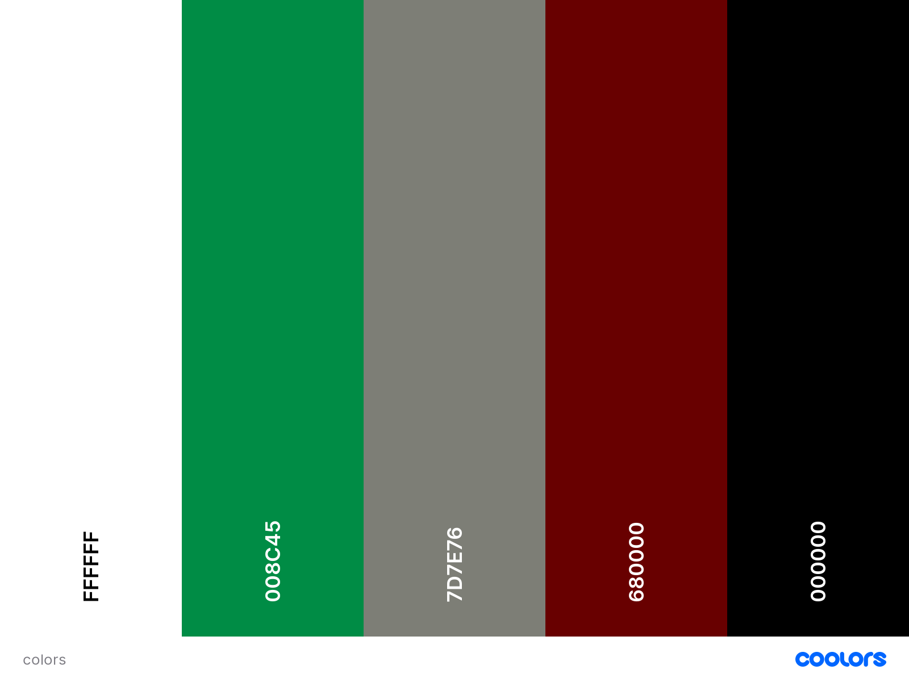

# **The Italian Corner**


## **Goal for this project** 
The italian corner is an E-commerce store, where it is possible to purchase different Italian products imported directly from Italy. Furthermore you can dive into the blog to get inspiration on what to do with the different Italian products and tools.
There is also the possibility to make a user, and sign up for a monthly wine subscription. Here you have 2 options, for a premium subscription or a normal one.

Thank you for visiting my project!
If you have any feedback or questions, head over to my GitHub contact details and feel free to reach out to me.

[Link to live website](https://the-italian-corner.herokuapp.com/)

---

## Table of contents 


## **UX**

### **User Stories**

#### User
* As a user I want to be able to view a list of products
* As a user I want to easily be able to view the total of my purchases at any time
* As a user I want to quickly be able to find out what features the site has
* As a user I want to be able to register for an account
* As a user I want to be able to easily login or out
* As a user I want to be able to easily recover my password in case i forgot it
* As a user I want to be able to get inspiration to how i can use the products
* As a user I want to be able to sort the products
* As a user I want to easily be able to purchase and go to checkout in a short time
* As a user I want to be able to understand what i am purchasing before checkout


#### Owner
* As a owner I want to be able to add products
* As a owner I want to be able to edit products
* As a owner I want to be able to delete products
* As a owner I want to be able to put up blogs
* As a owner i want to be able to view orders placed on my site
* As a owner I want to be able to change the monthly wine every month

#### User Expectations
* Easy to navigate.
* Flow of the sign up process takes a short time.
* Understand the purpose of the webiste within a short time.
* Find usefull information about Italian products.

--- 

## **Design Choices**

### Fonts
 I have visited [Google Fonts](https://fonts.google.com/ "Google Fonts") to explore the various options. The font i use in this project are [Lobster] (https://fonts.google.com/specimen/Lobster#standard-styles). The font is italic and has aa kind of italian flow over it.

### Icons
I have used icons from the [Font Awesome library](https://fontawesome.com/ "Font Awesome"). There is a limited amount of icons. But they fit the corresponding text. 

### Colors

You can view my color scheme [here](media/colors.png)



The feel of the website should give you a feeling of authentic Italian products

* #fff: White is used as the text color in most places, as it is easily seen on the page. Where White is hard to see, black is used instead.

* #008C45: This a green color that is used for the background and some of the links in collaboration with the grey/white and red to make the italian colors.

* #7D7E76: This is a smooth Grey color on the edge of White. It is used as the middle color of the Italian flag. White is not used, as the text would be hard to read.

* #68000: Is a dark red color that is used for the red part of the Italian flag for the background. 

* #000: Black is used as text color for the main-nav and as text in various places, where the White color was hard to see.

For the Italian flag all colors are gradiant, so the fluently flow into each other.

I have used contract checker on Coolors in order to make sure that the contract is sufficient.
In this way my content will be easily readable. 

### Changes made to color scheme

I started out with a White background on the product pages, but realised it would give a more Italian touch to go with the Italian flag with gradiant colors all over the site.

--- 

## **Structure**
The website structure is built with [Bootstrap](https://getbootstrap.com/).
Bootstrap provides content for both CSS and JavaScript, as functionality with both is important.
As Bootstrap is designed for mobile first, I will be certain that my website functions well on mobile. 

Django is used as the framework with everything seperated into apps.

### Home Page
The home page is a introduction to the different features of the website. From the homepage you can get to all the features the website has to offer.

### Products Page
The products page hold all the organic products the customers can buy. There they can see the price, rating, category and go to a more detailed page of the product.

### Product Detail page
The product detail page has a description of each product and the opportunity to add it to the bag. From the bag they can then checkout and buy the stuff they have put in there. 

### Profile Page
The profile page holds a order summery of their purchases as well as their order information, after the first time they buy something. Furhtermore it has a feature to subscribe to the monthly wine service or unsubscribe.

### blog page
The blog page holds blogs that the page owner puts out. These blogs are all tied to how you can use italian tools in the kitchen and experiences with Italian cousine. Each blog will have a short snippet of the blog, the blog owner and the date it was created.

### blog post page
The blog post page holds the blog in its full size, as well as who created it. 

### shopping bag/checkout
The shopping bag and checkout page holds the users products as they shop around. The checkout page is also where the user puts in their details. 


### **Wireframes**
I have decided to use [Balsamic](https://balsamiq.com/wireframes/) to create wireframes for my website. 
First I created a wireframe for mobile, as the approach is mobile first. Thereafter wireframes for desktop and tablets. 

You can find my wireframes below:

#### Desktop Wireframes 
* [Home page](media/wireframes/home_page_desktop.png)
* [Product page](media/wireframes/product_page_desktop.png)
* [Product Description page](media/wireframes/product_description_page_desktop.png)
* [Shopping Bag page](media/wireframes/shopping_bag_page_desktop.png)
* [Checkout page](media/wireframes/checkout_page_desktop.png)
* [Blog page](media/wireframes/blog_page_desktop.png)
* [Blog Post page](media/wireframes/blog_post_page_desktop.png)
* [Login page](media/wireframes/login_page_desktop.png)
* [Register page](media/wireframes/register_page_desktop.png)
* [Profile page](media/wireframes/profile_page_desktop.png)

#### Tablet Wireframes
* [Home page](media/wireframes/home_page_tablet.png)
* [Product page](media/wireframes/product_page_tablet.png)
* [Product Description page](media/wireframes/product_description_page_tablet.png)
* [Shopping Bag page](media/wireframes/shopping_bag_page_tablet.png)
* [Checkout page](media/wireframes/checkout_page_tablet.png)
* [Blog page](media/wireframes/blog_page_tablet.png)
* [Blog Post page](media/wireframes/blog_post_page_tablet.png)
* [Login page](media/wireframes/login_page_tablet.png)
* [Register page](media/wireframes/register_page_tablet.png)
* [Profile page](media/wireframes/profile_page_tablet.png)

#### Mobile Wireframes 
* [Home page](media/wireframes/home_page_mobile.png)
* [Product page](media/wireframes/product_page_mobile.png)
* [Product Description page](media/wireframes/product_description_page_mobile.png)
* [Shopping Bag page](media/wireframes/shopping_bag_page_mobile.png)
* [Checkout page](media/wireframes/checkout_page_mobile.png)
* [Blog page](media/wireframes/blog_page_mobile.png)
* [Blog Post page](media/wireframes/blog_post_page_mobile.png)
* [Login page](media/wireframes/login_page_mobile.png)
* [Register page](media/wireframes/register_page_mobile.png)
* [Profile page](media/wireframes/profile_page_mobile.png)


### Database planning 
My database structure holds a number of different collections. We have the categories: blog, checkout, products, accounts, authentication and authorization. The accounts, authentication and authorization collections are all features of Django AllAuth, and i will therefore not specify much about them. The checkout and products collection are roughly taken from the trial Boutique Ado project at Code Institutes course. On the models there are small modifications. The blog collection is new.

#### blog collection
The blog collection hold the Posts. Each post have an Author, Title, slug, content and status.

```yaml
Posts:
    title = models.CharField()
    slug = models.SlugField()
    author = models.ForeignKey()
    updated_on = models.DateTimeField()
    content = models.TextField()
    created_on = models.DateTimeField()
    status = models.IntegerField()
```

#### products collection
The product collection holds two models. The first is the categories model. This model holds the categories and their friendly_name for screen purposes. The second model is the product model. That model holds all the information about the products. 

```yaml
Categories:
    name = models.CharField()
    friendly_name = models.CharField()
```

```yaml
Products:
    category = models.ForeignKey()
    sku = models.CharField()
    name = models.CharField()
    description = models.TextField()
    size = models.IntegerField()
    price = models.DecimalField()
    origin = models.CharField()
    rating = models.DecimalField()
    image_url = models.URLField()
    image = models.ImageField()
```
#### checkout collection
The checkout collection holds the Orders on the page. Each order has the details of the customer, products they bought and how much they paid.
```yaml
Orders:
    order_number = models.CharField()
    user_profile = models.ForeignKey()
    full_name = models.CharField()
    email = models.EmailField()
    phone_number = models.CharField()
    country = CountryField()
    postcode = models.CharField()
    town_or_city = models.CharField()
    street_address1 = models.CharField()
    street_address2 = models.CharField()
    county = models.CharField()
    date = models.DateTimeField()
    delivery_cost = models.DecimalField()
    order_total = models.DecimalField()
    grand_total = models.DecimalField()
    original_bag = models.TextField()
    stripe_pid = models.CharField()
```
### Features to be implemented

* A heatmap over where diving is good during different seasons.
* Access to store with diving gear.
* community forum, where users can discuss various subjects.
* Google map functionality, where dives of users get shown on map upon dive entry. 

--- 

## **Technologies used**

### Languages

* [HTML](https://en.wikipedia.org/wiki/HTML)
* [CSS](https://en.wikipedia.org/wiki/Cascading_Style_Sheets)
* [JavaScript](https://en.wikipedia.org/wiki/JavaScript)
* [Python](https://en.wikipedia.org/wiki/Python_(programming_language))

### Libraries & Frameworks

- [Django](https://flask.palletsprojects.com/) - Python web framework, used for displaying data from backend databases to frontend presentation.
- [dj-database-url](https://flask.palletsprojects.com/) -
- [gunicorn](https://flask.palletsprojects.com/) -
- [Pillow](https://flask.palletsprojects.com/) -
- [Stripe](https://flask.palletsprojects.com/) -
- [AWS](https://flask.palletsprojects.com/) -
- [Bootstrap](https://getbootstrap.com/) - CSS framework, mainly used for components.
- [jQuery](https://jquery.com/) - JavaScript library, used for refactoring code.
- [PostGress](https://www.mongodb.com/) - Cloud-based NoSQL database, used for housing data.
- [Google Fonts](https://fonts.google.com/) - Lobster font used in the design throughout.
- [FontAwesome](https://fonts.google.com/icons) - Used in the design throughout.
- [DNSPython](https://pypi.org/project/dnspython/) - DNS toolkit for Python.

### Tools
* [Git](https://git-scm.com/)
* [GitPod](https://www.gitpod.io/)
* [Balsamic](https://balsamiq.com/wireframes/)
* [W3C HTML Validation Service](https://validator.w3.org/)
* [W3C CSS Validation Service](https://jigsaw.w3.org/css-validator/)

--- 

## **Testing**

#### User story: As a user I want to easily be able to view the total of my purchases at any time
* **Plan**
The user should easily recognize the total in the top corner in the shopping bag and see the total when navigating to the bag.

* **Test**    


* **Result**  


* **Verdict**  


#### User story: As a user I want to quickly be able to find out what features the site has
* **Plan** 
The user should navigate down the main page to read about all the features of the page or use the navigation menu to get around the different areas of the page.

* **Test** 


* **Result** 


* **Verdict** 
The test has passed all the criteria and works like planned.

#### User story: As a user I want to be able to register for an account
* **Plan** 
The user should reqognize the my account logo on top and understand that is where they sign up for a profile. Alternatively the user signs up through navigating to the subscription page.


* **Test**  


* **Result** 


* **Verdict**  
The test has passed all the criteria and works like planned.
 

#### User story: As a user I want to be able to easily login or out
* **Plan** 
The user should recognize that he/she can log out and in through the my account menu in the main nav bar. 

* **Test** 

* **Result** 

* **Verdict**     
The test has passed all the criteria and works like planned.

#### User story: As a user I want to be able to easily recover my password in case i forgot it
* **Plan** 
The user can get a new password on the login page, if they do not remember their current one. This should be intuitive to find.

* **Test** 

* **Result** 

* **Verdict**     
The test has passed all the criteria and works like planned.

#### User story: As a user I want to be able to get inspiration to how i can use the products
* **Plan** 
The user should navigate to the blog page, where they can find inspiration on how to use the different Italian products. 

* **Test** 

* **Result** 

* **Verdict**     
The test has passed all the criteria and works like planned.

#### User story: As a user I want to be able to sort the products
* **Plan** 
The user can either use the categories in the main nav bar to sort the kind of products they like or use the filter functionality to find products according to different criteria.

* **Test** 

* **Result** 

* **Verdict**     
The test has passed all the criteria and works like planned.

#### User story: As a user I want to easily be able to purchase and go to checkout in a short time
* **Plan** 
The user should be able to add products to their bag and navigate to checkout within a short time period.

* **Test** 

* **Result** 

* **Verdict**     
The test has passed all the criteria and works like planned.

#### User story: As a user I want to be able to understand what I am purchasing before checkout
* **Plan** 
The user can see their purchases in a small window at the top of the screen, as well as in the bag before purchase. They should be able to tell easily what products they are buying. 

* **Test** 

* **Result** 

* **Verdict**     
The test has passed all the criteria and works like planned.


### **Bugs**

#### 1. The Subscription button would not take me to the payment page.
* **Solution** 


#### 2. I had troubles migrating my database to Postgress after putting entries into sqlite

* **Solution** 

Had to put files into a json file and then upload them to the postgres database.

#### 3 

* **Solution**


--- 

## **Deployment**

1. Create project with [Code Institute full template](https://github.com/Code-Institute-Org/gitpod-full-template). 
2. Create new repository from template
3. Open up repository with Gitpod/VSCode/IDE of choice. 

### Local deployment

1. Log into your GitHub account and find the repository.
2. Click on the 'Code' button (next to 'Add file').
3. To clone the repository using HTTPS, under clone with HTTPS, copy the link.
4. Then open Git Bash.
5. Change the current working directory to where you want the cloned directory to be made.
6. In your IDE's terminal type 'git clone' followed by the URL you copied.
7. Press Enter.
8. Your local clone will now be made.

### Deployment to Heroku

1. Log in to [Heroku](https://www.heroku.com/).
2. Click 'New' on the Dashboard and select 'Create new app'.
3. Select your region and create an app name. ideally call the app the same as your project.
4. Make sure you add all your environment and configuration variables in 'Config Vars' under 'Settings' tab. 
4. Select 'Deploy' option in menu. 
5. Enable automatic deployments from your GitHub by connecting accounts and selecting automatic deployment option. 
6. Click 'Deploy branch' 

### Using Postgress

1. Create an account with MongoDB.
2. Create a database 'cluster'.
3. Within your newly created cluster, create a database.
4. Within your newly created database, create collections. These collections will store your documents (where the data is housed).
5. Connect your application by clicking 'Connect' in the 'Databases' section.
6. Link up your codebase with MongoDB by adding sensitive variables to your local env.py and config vars in Heroku. 
7. If you're using tech like Flask, you will need to install other dependencies to aid technologies working together.
--- 

### ** Credit **
I have drawn much inspiration from different posts on Stackoverflow. Furthermore much inspiration is taken from the trial project Boutique Ado in the Code Institute course, as the functionality there is perfect for an E-commerce store. 
Credit is also given to my mentor [Spence_mentor], whom have helped me during the project period. 

### **Acknowledgements**
I want to thank the 3 people who tested the website(Andreas, Niels and Susanne). They gave valuable feedback to optimize the structure and feel of the website.

